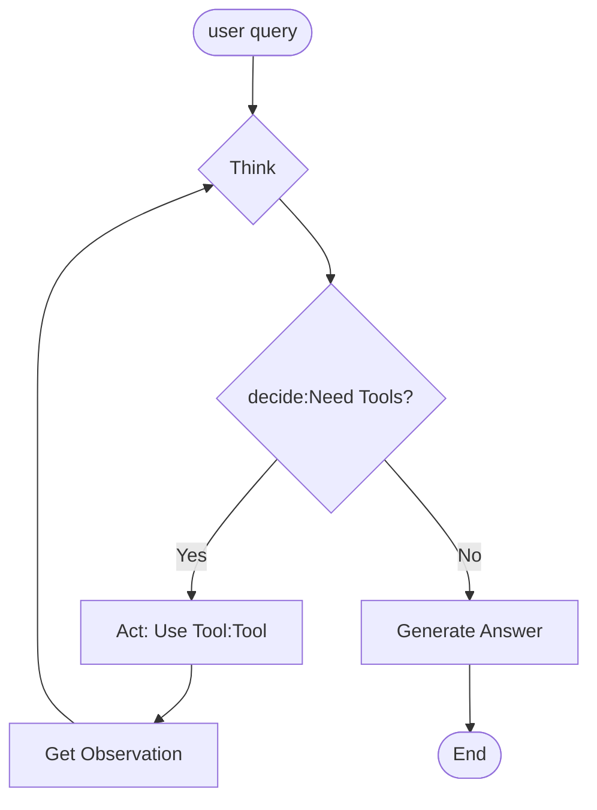
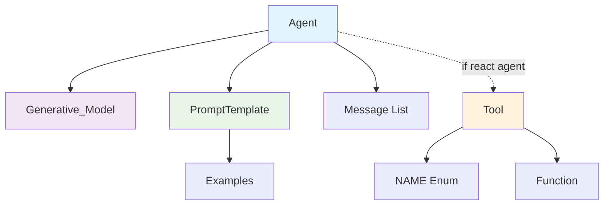
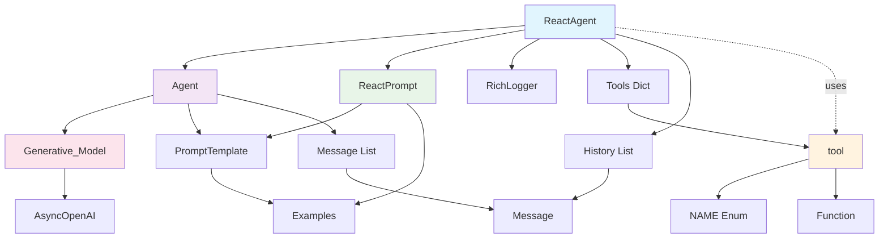

# 从零开始构建本地文件搜索Agent

## 引言：最近面试了一个做ai agent相关领域的初创公司，要求我做一个local file search的ai agent，整篇文章用于记录我的设计思路，源码位于
https://github.com/mbt1909432/Local-File-Search-Agent

## 项目目标：
在这个项目中我旨在允许让用户输入自然语言询问（query）来得到本地文件的各种信息,例如:特定文件夹下pdf的数量，隐藏文件的名称等等

## 核心解决方案：
使用llm根据用户的query去生成结构化数据（调用函数的参数）去调用工具，后续将将工具返回结果注入到llm上下文窗口中来辅助llm判断

## 为什么需要生成结构化数据？
1. 语言模型本身是无法读取本地文件的，只有借助外部的工具（tools）访问本地文件
2. 工具参数本质是结构化的数据，只需要llm能生成结构化参数就能去调用工具

基于此核心解决方案的agent：
react agent reasoning and acting agent

## 什么是react agent？
react agent能够根据user query去think 然后去decide是否要去act（例如调用工具），
并根据act的结果（observation）去做answer。在这个项目中act就是去调用文件搜索以及文件计数的工具，observation可以是某些文件的数量或者某些文件的名字

React Agent能够基于用户查询进行思考(think)，继而决定(decide)是否执行操作(act)[如调用工具]，并根据观测结果（observation）生成回答。
在本项目中，act指的是调用文件搜索和文件计数工具，而observation可以是特定文件的数量或文件名列表。

因此，整体工作流程如下：
用户输入查询
React Agent 进行思考(think)
React Agent 决定(decide)是否使用(act)工具(tools)
如果需要使用工具，则调用工具获取结果(observation)，然后再次进入思考状态
如果不需要调用工具，则直接生成答案(answer)，React 生命周期结束




# React Agent 基本模块构建

为了构建react模块我们需要先构建几个基本模块，分别是工具模块、Generative Model模块、Prompt模块和agent模块。

## 1. 工具基本模块

### 描述
工具包含工具名称（NAME）与对应的Python方法（func），工具可通过tool_use进行调用。

### 备注
在本文中，我们将func定义为`Callable[..., Any]`，这意味着允许LLM生成各种形式的参数，因为Python方法的参数传递具有可变性。

### 核心代码

```python
from enum import Enum, auto
from typing import Callable, Any

class NAME(Enum):
    COUNT_FILES = auto()
    FIND_FILES = auto()

    def __str__(self):
        return self.name.lower()

class tool:
    def __init__(self, name: NAME, func: Callable[..., Any]):
        self.name = name
        self.func = func

    def tool_use(self, **kwargs) -> str:
        try:
            return str(self.func(**kwargs))
        except Exception as e:
            return str(e)

    def get_tool_info(self):
        return f"tool_name:{self.name.name.lower()}|tool_description:{self.func.__doc__}"
```

## 2. Generative Model基本模块

### 描述
Generative Model模块是构建agent的核心能力，相当于大脑。它通过调用某些API厂商的服务来构建，且本身是无状态的，不存储任何记忆。Generative Model只能根据用户传入的消息进行相应的生成。

### 核心代码

```python
from openai import AsyncOpenAI
from typing import List, Optional

class Generative_Model:
    def __init__(self, model: str):
        self._client = AsyncOpenAI(
            api_key="YOUR_API_KEY",
            base_url="ENDPOINT",
        )
        self.model = model

    async def generate(
        self,
        messages: List[Message],
        model=None
    ):
        response = await self._client.chat.completions.create(
            model=self.model if model is None else model,  
            messages=[message.model_dump() for message in messages],
        )
        return response.choices[0].message.content
```

## 3. Prompt基本模块

### 描述
Prompt由system prompt和user prompt两部分构成。System prompt用于指导agent的全局生成过程，包含prefix、examples和suffix等关键元素。User prompt则用于指示agent操控生成模型进行信息生成。值得注意的是，system prompt和user prompt的参数均支持动态配置与注入，具有高度的灵活性。

### 核心代码

```python
from string import Template
from typing import List, Optional
from enum import Enum

class PromptType(Enum):
    PREFIX = "prefix"
    SUFFIX = "suffix"
    USER = "user"

class Example:
    def __init__(self, input: str, output: str):
        self.input = input
        self.output = output

class PromptTemplate:
    def __init__(self):
        """初始化提示模板"""
        self.prefix = ""
        self.examples: List[Example] = []
        self.suffix = ""
        self.user = ""
        
    def set_examples_str(self) -> str:
        if not self.examples:
            return ""
            
        examples_str = "\n\nExamples:\n"
        for i, example in enumerate(self.examples, 1):
            examples_str += f"Example {i}:\n"
            examples_str += f"Input:\n{example.input}\n"
            examples_str += f"Output:\n{example.output}\n\n"
        return examples_str

    def _format_prompt(self, prompt: str, prompt_type: PromptType, **kwargs) -> Optional[str]:
        return Template(prompt).substitute(**kwargs)  # TODO:添加安全检测 若传参不完全

    def get_format_system_prompt(self, **kwargs) -> str:
        formatted_prefix = self._format_prompt(self.prefix, PromptType.PREFIX, **kwargs) or ""
        formatted_suffix = self._format_prompt(self.suffix, PromptType.SUFFIX, **kwargs) or ""
        examples_str = self.set_examples_str()
        result = formatted_prefix + examples_str + formatted_suffix

        if result is None:
            result = ""

        return result

    def get_format_user_prompt(self, **kwargs) -> str:
        formatted_user = self._format_prompt(self.user, PromptType.USER, **kwargs) or ""
        return formatted_user
```

## 4. Agent基本模块

### 描述
Agent有着系统级别的记忆(prompt_template)以及list-based的记忆(_messages)，能够以记忆模式回复也可以用无记忆模式进行回复。

### 核心代码

```python
from typing import Optional, List

class Message:
    def __init__(self, role: str, content: str):
        self.role = role
        self.content = content
    
    def model_dump(self):
        return {"role": self.role, "content": self.content}

class Agent:
    def __init__(self, agent_name: str, prompts_template: PromptTemplate, model="deepseek/deepseek-chat"):
        self._agent_name = agent_name
        self.model = Generative_Model(model)  # 一个agent持有一种模型，不可替换，generative model本身无状态可以换
        self.prompts_template = prompts_template  # system prompt
        self._messages: Optional[List[Message]] = None

    def refresh_system(self, **kwargs):
        """若系统记忆需要更新则调用"""
        if self._messages is None:
            self._messages = [Message(role="system", content=self.prompts_template.get_format_system_prompt(**kwargs))]
        else:
            self._messages[0] = Message(role="system", content=self.prompts_template.get_format_system_prompt(**kwargs))

    async def response_with_memory(
        self,
        query,
        **kwargs  # system 参数
    ):
        """有list_base 记忆的回复，kwargs为系统所需参数"""
        self.refresh_system(**kwargs)

        if kwargs:
            self.refresh_system(**kwargs)

        self._messages.append(Message(role="user", content=query))

        response = await self.model.generate(self._messages)

        self._messages.append(Message(role="assistant", content=response))

        return response

    async def response_without_memory(
        self,
        query,
        **kwargs
    ):
        """无list_based记忆的回复，kwargs为系统所需参数"""
        self.refresh_system(**kwargs)

        messages = [
            Message(role="system", content=self.prompts_template.get_format_system_prompt(**kwargs)),
            Message(role="user", content=query)
        ]
        response = await self.model.generate(messages)

        return response
```

## 基础模块关系图


在上述图示中，react agent将会用到tool模块，纯粹的agent本身是不携带任何tool的


# React Agent 模块构建

## 描述
ReactAgent继承自基础Agent类，实现了ReAct（Reasoning and Acting）范式。
它采用think-decide-act的循环模式，维护用户查询记忆以缩短上下文长度，避免token消耗过多。

## 核心伪代码

```
class ReactAgent(Agent):
    __init__():
        继承基础Agent
        设置max_iteration = 5
        初始化tools = {}
        初始化history = []
        创建custom_logger

    add_tool(tool_instance):
        将工具添加到tools字典中

    set_history(step, role, content):
        添加Message到history
        输出调试日志

    get_history():
        如果history为空: 返回"暂无历史记录"
        否则: 返回最近10条记录的格式化字符串

    async think(query):
        current_iteration += 1
        记录当前迭代信息
        
        如果 current_iteration >= max_iteration:
            记录"到达最大次数"并返回
        
        构建query_template:
            - 注入用户query
            - 注入history
            - 注入可用tools信息
        
        调用语言模型生成response
        记录response到history
        进入decide(response, query)

    async decide(response, query):
        尝试:
            解析JSON response
            
            如果response包含"action":
                提取tool_name和parameters
                验证工具是否存在:
                    存在: 进入act阶段
                    不存在: 重新think
                    
            如果response包含"answer":
                记录最终答案
                
        捕获异常:
            记录错误信息
            重新think

    async act(name, query, input_params):
        获取指定tool
        
        如果tool存在:
            执行tool.tool_use(**input_params)
            记录observation结果
            基于结果重新think
        否则:
            记录"工具不存在"
            重新think

    async execute(query):
        重置current_iteration和history
        开始think循环
        提取并返回final_answer
```


## ReactAgent模块关系图



## ReactPrompt

### 为什么需要Prompt？

在构建React Agent的过程中，Prompt设计是整个系统的"灵魂"。一个好的Prompt就像是给AI助手的详细工作手册，它决定了Agent能否准确理解任务、合理使用工具、并给出高质量的回答。

### 我的Prompt设计哲学

了几个关键原则：

#### 1. 角色定位要清晰
```
"You are an advanced ReAct (Reasoning and Acting) agent..."
```
不是简单的"你是一个AI"，而是明确告诉模型它是一个具备推理和行动能力的专业Agent。这种角色定位让模型更容易进入"工作状态"。

#### 2. 任务目标要具体
```
"Your mission is to thoroughly understand the query and execute 
the most effective approach to deliver accurate, comprehensive answers."
```
用"mission"而不是"goal"，传达出一种使命感。同时强调"thoroughly understand"和"most effective approach"，引导模型进行深度思考。

#### 3. 工作流程标准化
我设计了严格的JSON输出格式，包含两种场景：
- **需要使用工具时**：包含thought（思考过程）、action（具体行动）
- **可以给出答案时**：包含thought（推理过程）、answer（最终答案）

这种标准化确保了输出的可解析性和一致性。

### 核心prompt代码展示

```python
class ReactPrompt(PromptTemplate):
    def __init__(self):
        super().__init__()
        self.user = """
You are an advanced ReAct (Reasoning and Acting) agent designed to 
systematically analyze and respond to user queries through structured 
reasoning and strategic tool utilization.

Query: ${query}
Previous reasoning steps and observations: ${history}
Available tools: ${tools}

# 详细的指导原则和JSON格式要求...
"""
```

# React Agent 用例


## 工作流程详解

### Think阶段
- 接收用户查询
- 分析当前历史记录
- 检查可用工具列表
- 生成结构化响应（JSON格式）

### Decide阶段
- 解析Think阶段的JSON响应
- 判断是否需要调用工具
- 验证工具名称和参数
- 处理解析错误和异常

### Act阶段
- 执行具体的工具调用
- 获取工具执行结果（observation）
- 将结果记录到历史中
- 触发新一轮Think


## 基本使用流程

### 1. 创建Agent实例
```
agent = ReactAgent(model="deepseek/deepseek-chat")
创建文件操作工具:
    - count_tool = tool(name=COUNT_FILES, func=count_files_function)
    - find_tool = tool(name=FIND_FILES, func=find_files_function)
agent.add_tool(count_tool)
agent.add_tool(find_tool)
```

### 2. 执行查询示例

**示例1：统计文件数量**
```
query = "统计当前目录下有多少个Python文件？"
result = await agent.execute(query)

执行流程：
Think: 分析query，决定使用count_files工具
Decide: 解析response，提取tool调用参数
Act: 调用count_files(directory=".", extension=".py")
Think: 基于observation生成final_answer
```


# 后序优化策略：

- 如果优化仅针对当前项目的文件夹（例如，Cursor读取项目文件），则可能需要让 Agent 了解当前项目的目录结构和位置，或提供需要搜索的目录。

- 当需要搜索的目录结构过于深层时，例如文件位于 E 盘的某个深层路径下，而用户仅指定了该路径的部分信息，则可能无法进行有效搜索。这可以通过添加额外的工具链来解决，例如新增一个 `search_folder()` 方法，直接传入文件夹参数以返回完整路径。

- 总而言之，可以添加系统信息并完善工具链路，以增强搜索性能。


